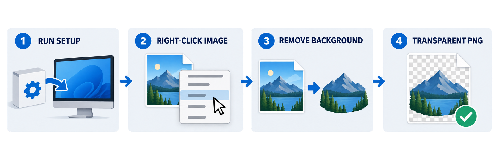
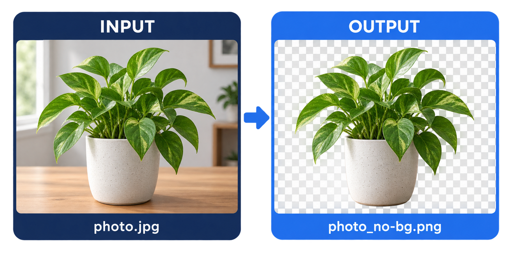

# Background Remover

Remove an image's background directly from Windows Explorer. The application uses [rembg](https://github.com/danielgatis/rembg) locally and writes a transparent PNG beside the original image.

## At a glance



_Install once, then use the command directly from an image's Explorer context menu._

## What it does

After installation, right-click an image and select **Remove Background**. On Windows 11, the command is under **Show more options** in the classic context menu.

For an input named `photo.jpg`, the default output is:

```text
photo_no-bg.png
```



_Only the background is removed. The detected subject is preserved and the result is saved as a PNG with transparency._

The original image is left unchanged. Processing happens on your computer; the first removal may download the rembg model, but images are not uploaded to a service.

## Install the Explorer command

There are two installers:

- **`RemoveBackground-Setup.exe`** is a small online installer. It downloads the stable `remove-bg.exe` release and adds the menu entry.
- **`remove-bg.exe`** is the complete application. New builds are self-installing when double-clicked.

Run either EXE once, then:

1. Right-click a JPG, PNG, WebP, BMP, TIFF, or another image type recognized by Windows and Pillow.
2. On Windows 11, select **Show more options**.
3. Select **Remove Background**.

Running the EXE without an image installs it for the current Windows user at:

```text
%LOCALAPPDATA%\Programs\RemoveBackground\remove-bg.exe
```

It registers the menu under `HKEY_CURRENT_USER`, so administrator rights are not required. Run a newer build the same way to update or repair the installation.

### Uninstall

Run this command, then optionally delete the installation directory shown above:

```powershell
& "$env:LOCALAPPDATA\Programs\RemoveBackground\remove-bg.exe" --uninstall
```

From a source checkout, `install.ps1` provides the same shortcut:

```powershell
.\install.ps1 -Uninstall
```

## Build the EXE

### Requirements

- Windows 10 or Windows 11, 64-bit
- Python 3.11, 3.12, or 3.13
- Internet access while installing Python packages and downloading the AI model

The current rembg release does not support Python 3.14. The build script defaults to the Windows Python launcher with Python 3.13.

### Build

```powershell
.\build.ps1
```

The script creates `.venv`, installs the CPU version of rembg and PyInstaller, and produces:

```text
dist\remove-bg.exe
```

If Python 3.13 is not registered with `py`, pass a compatible interpreter explicitly:

```powershell
.\build.ps1 -PythonPath "C:\Path\To\Python312\python.exe"
```

Double-click the resulting EXE to install the context menu, or run:

```powershell
.\install.ps1
```

The executable is intentionally built with a console window so progress and model-download errors remain visible when Explorer launches it. Because the EXE is not code-signed, Windows SmartScreen may warn when it is downloaded on another computer.

### Build the small online setup EXE

This option needs only Windows; it does not require Python. It packages `install.ps1` with Windows IExpress:

```powershell
.\build-setup.ps1
```

The output is:

```text
dist\RemoveBackground-Setup.exe
```

When run, this setup program downloads `remove-bg.exe` and `icon.ico` from the repository's `stable-releases` GitHub release, installs them under `%LOCALAPPDATA%`, and adds the Explorer command. Internet access is therefore required during setup.

## Run from source

Create an environment with a supported Python version:

```powershell
py -3.13 -m venv .venv
.\.venv\Scripts\Activate.ps1
python -m pip install --upgrade pip
python -m pip install -r requirements.txt
```

Process one or more files:

```powershell
python .\main.py "C:\Images\photo.jpg"
python .\main.py "C:\Images\one.jpg" "C:\Images\two.png"
```

Process a directory:

```powershell
python .\main.py "C:\Images"
python .\main.py --recursive "C:\Images"
```

### Command-line options

| Option | Purpose |
| --- | --- |
| `-o`, `--output-dir DIR` | Write generated PNG files to another directory. |
| `-s`, `--suffix TEXT` | Change the default `_no-bg` filename suffix. |
| `--overwrite` | Replace an existing output file. |
| `--inplace` | Replace the source with a PNG and keep one `.bak` backup. |
| `-r`, `--recursive` | Include subdirectories when a directory is supplied. |
| `--install` | Install or repair the context menu from the built EXE. |
| `--uninstall` | Remove the context-menu registration. |

For all options:

```powershell
python .\main.py --help
```

## How the Explorer integration works

The installer copies the built executable into the current user's local application directory and registers a Shell verb at:

```text
HKCU\Software\Classes\SystemFileAssociations\image\shell\RemoveBackground
```

Explorer passes the selected image path to `remove-bg.exe`. Registering against the `image` association makes the command available across image extensions recognized by Windows, rather than maintaining a separate registry entry for every extension.

## Project files

| File | Purpose |
| --- | --- |
| `main.py` | CLI, background-removal logic, and context-menu install/uninstall code. |
| `build.ps1` | Creates the virtual environment and builds the self-installing EXE. |
| `build-setup.ps1` | Builds the small online setup EXE using Windows IExpress. |
| `remove-bg.spec` | PyInstaller configuration, including rembg and ONNX Runtime files. |
| `install.ps1` | Installs a local build, or downloads and installs the stable release. |
| `requirements.txt` | Runtime dependencies. |
| `requirements-build.txt` | Runtime dependencies plus PyInstaller. |
| `icon.ico` | Icon embedded in the EXE and displayed in Explorer. |
| `docs/images/` | Explanatory graphics used by this README. |

## Troubleshooting

- **The menu item is missing:** On Windows 11, check **Show more options**. If it is still missing, run the EXE again to repair the registration, then restart Explorer.
- **The first run is slow:** rembg downloads its AI model the first time it processes an image. Later runs reuse the cached model.
- **`No onnxruntime backend found`:** Install the current Microsoft Visual C++ 2015–2022 Redistributable (x64), then rebuild or rerun the application.
- **The output already exists:** Use `--overwrite`, change `--suffix`, or move the existing output.
- **A format is skipped:** The file must be readable by Pillow. Some formats require an additional Pillow plugin or conversion to PNG/JPEG first.
